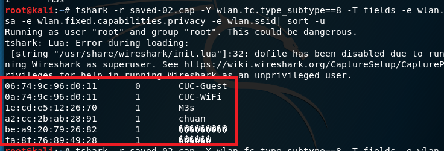

# chap0x02 无线接入网监听实验
## 实验环境
- 虚拟机：virtual box 5.2.18 r124319，4.17.0-kali1-amd64
- Realtek RTL8187
- wireshark
- tshark

## 实验原理
- 使用 **channel hopping** 技术来摸清当前所在位置有哪些无线网络可用、可被监听到
	- 802.11无线网络中，由于STA的工作模式限制，无线网卡需要通过channel hopping技术在多个信道之间切换才能尽可能的去模拟对所有信道的数据获取（监听）
- 802.11帧结构
	- 管理帧，包括身份认证数据包、关联数据包和Beacon数据包等
	- 控制帧，控制帧通常与数据帧搭配使用，负责清空区域、获取信道和载波监听的维护，并在收到数据时予以确认以提高工作站之间数据传送的可靠性。
	- 数据帧
- 802.11 加密与认证机制原理
	- 开放式认证：任何知道基站SSID的客户端都可以连接到此网络
	- WPA/WPA2:有线等级隐私(WEP)标准并不安全，目前最主要的无线安全机制：WPA和WPA2。
	- RSN（Robust SecurityNetwork）：这组程序主要定义了密钥的产生与传递方式。
	- 四次握手认证（four-way handshake）：802.11i 规范了一种衍生密钥的机制
- wireshark过滤器语法

		wlan.fc.type eq 0# 管理帧
			wlan.fc.type_subtype == 0x08 #beacon frame
			wlan.fc.type_subtype == 0x04 #Probe request frame
			wlan.fc.type_subtype == 0x05 #Probe Response frame
			wlan.fc.type_subtype == 0x0b #Authentication frame
			wlan.fc.type_subtype == 0x00 #Association request frame
			wlan.fc.type_subtype == 0x01 #Association response frame
		wlan.fc.type eq 1# 控制帧
			wlan.fc.type_subtype == 0x1b #RTS
			wlan.fc.type_subtype == 0x1c #CTS
			wlan.fc.type_subtype == 0x1d #ACK
		wlan.fc.type eq 2# 数据帧
## 实验步骤

- 开启无线网卡
	
	
	- 执行 `iwconfig` 查看网卡参数
	
		
- 执行 `iw dev wlan0 scan | grep SSID | xargs -0 echo -e`# 仅查看附近无线网络的SSID，自动处理UTF-8编码的SSID名称

		root@kali:~# iw dev wlan0 scan | grep SSID | xargs -0 echo -e
				SSID: CMCC-WEB
				SSID: CMCC
				SSID: and-Business
				SSID: CMCC-WEB
				SSID: CMCC
				SSID: and-Business
				SSID: CUC-Guest
				SSID: CUC-WiFi
				SSID: CMCC
				SSID: CMCC
				SSID: and-Business
				SSID: CUC-Guest
				SSID: CUC-WiFi
				SSID: M3s
				SSID: 小漂亮的热点
				SSID: CMCC-WEB
				SSID: CUC-Guest
				SSID: CUC-WiFi
				SSID: CUC-Guest
				SSID: and-Business
				SSID: 开心
- 执行 `iw phy ph2 channels`# 查看当前网卡支持的监听 channel

		root@kali:~# iw phy phy2 channels
		Band 1:
			* 2412 MHz [1] 
			  Maximum TX power: 20.0 dBm
			  Channel widths: 20MHz
			* 2417 MHz [2] 
			  Maximum TX power: 20.0 dBm
			  Channel widths: 20MHz
			* 2422 MHz [3] 
			  Maximum TX power: 20.0 dBm
			  Channel widths: 20MHz
			* 2427 MHz [4] 
			  Maximum TX power: 20.0 dBm
			  Channel widths: 20MHz
			* 2432 MHz [5] 
			  Maximum TX power: 20.0 dBm
			  Channel widths: 20MHz
			* 2437 MHz [6] 
			  Maximum TX power: 20.0 dBm
			  Channel widths: 20MHz
			* 2442 MHz [7] 
			  Maximum TX power: 20.0 dBm
			  Channel widths: 20MHz
			* 2447 MHz [8] 
			  Maximum TX power: 20.0 dBm
			  Channel widths: 20MHz
			* 2452 MHz [9] 
			  Maximum TX power: 20.0 dBm
			  Channel widths: 20MHz
			* 2457 MHz [10] 
			  Maximum TX power: 20.0 dBm
			  Channel widths: 20MHz
			* 2462 MHz [11] 
			  Maximum TX power: 20.0 dBm
			  Channel widths: 20MHz
			* 2467 MHz [12] 
			  Maximum TX power: 20.0 dBm
			  No IR
			  Channel widths: 20MHz
			* 2472 MHz [13] 
			  Maximum TX power: 20.0 dBm
			  Channel widths: 20MHz
			* 2484 MHz [14] 
			  Maximum TX power: 20.0 dBm
			  No IR
			  Channel widths: 20MHz
- 设置网卡进入监听模式
	- 执行 `airmon-ng check kill`
	- 执行 `airmon-ng start wlan0`
	- 执行 `iwconfig` ，无线网卡已切换到监听模式
	
		
- 执行 `airodump-ng wlan0mon --channel 13 -w saved --beacons --wps`选择channel 13 进行定向抓包 

		 CH 13 ][ Elapsed: 3 mins ][ 2018-10-06 04:41 ][ WPA handshake: 0A:74:9C:96:D0:11                                      
		                                                                                                                       
		 BSSID              PWR RXQ  Beacons    #Data, #/s  CH  MB   ENC  CIPHER AUTH WPS     ESSID
		                                                                                                                       
		 0A:74:9C:96:D0:12   -1   0        0        0    0  13  -1                    0.0     <length:  0>                     
		 06:74:9C:96:D0:11  -45  52     1640       49    0  13  130  OPN                      CUC-Guest                        
		 0A:74:9C:96:D0:11  -52   0     1594    23348  119  13  130  WPA2 CCMP   MGT          CUC-WiFi                         
		 FA:8F:76:89:49:28  -60  13      381        0    0  11  130  WPA2 CCMP   PSK          开心                             
		 A2:CC:2B:AB:28:91  -76   0       90       11    0  13  130  WPA2 CCMP   PSK          chuan                            
		 1E:CD:E5:12:26:70  -77   0        8        0    0  11   65  WPA  CCMP   PSK  2.0     M3s                              
		 0A:74:9C:97:75:58   -1   0        0        0    0  13  -1                    0.0     <length:  0>                     
		                                                                                                                        
		 BSSID              STATION            PWR   Rate    Lost    Frames  Probe                                              
		                                                                                                                        
		 (not associated)   E0:94:67:31:39:59  -61    0 - 6      0       12                                                     
		 (not associated)   28:CF:DA:D4:83:AA  -62    0 - 1      0       13                                                     
		 (not associated)   4C:32:75:8B:E6:4F  -63    0 - 1      0        4                                                     
		 (not associated)   20:5D:47:EC:95:A7  -64    0 - 1      0      157  cuc                                                
		 (not associated)   3C:B6:B7:E4:E6:07  -65    0 - 1      0        6                                                     
		 (not associated)   94:D0:29:C9:55:91  -68    0 - 1      0       12                                                     
		 (not associated)   FE:55:FA:28:3D:30  -69    0 - 1      0        1                                                     
		 (not associated)   DA:A1:19:B7:58:36  -69    0 - 1      0        1                                                     
		 (not associated)   40:E2:30:D1:F3:05  -69    0 - 1      0        2                                                     
		 (not associated)   26:B8:26:78:FE:24  -70    0 - 1      0        1                                                     
		 (not associated)   DA:A1:19:18:D4:6D  -70    0 - 1      0        1                                                     

## 实验结论
通过分析抓包保存的pcap文件：

#####  Q1. 查看统计当前信号覆盖范围内一共有多少独立的SSID？其中是否包括隐藏SSID？哪些无线热点是加密/非加密的？加密方式是否可知？
- 打开Wireless->WLAN Traffic，发现当前信号覆盖范围内共有6个独立的SSID，其中没有隐藏的SSID
		
	
	- 进一步解析此SSID名称
	
		
		
		
- 当前范围内未找到隐藏的SSID，但在部分手机广播的Probe Request Frame中可找到Wildcard

	
		
- 无线热点是否被加密
	- 执行 `tshark -r saved-02.cap -Y wlan.fc.type_subtype==8 -T fields -e wlan.sa -e wlan.fixed.capabilities.privacy -e wlan.ssid| sort -u`
	-  **1** 表示被加密， **0** 表示未被加密 
		
		
	- 选择一个加密AP的MAC地址，设置过滤规则`(wlan.bssid==0a:74:9c:96:d0:11) && wlan.fc.type_subtype== 0x0b `，加密方式是可知的

		

#####  Q2. 如何分析出一个指定手机在抓包时间窗口内在手机端的无线网络列表可以看到哪些SSID？这台手机尝试连接了哪些SSID？最终加入了哪些SSID？
- 无线网络列表可以看到的SSID有2种来源
	1. 被动模式：手机根据Beacon frame收集的SSID，也就是问题1中当前信号覆盖范围内的独立SSID
		
	2. 主动模式：通过发送 Probe Request frame去查询「曾经连接过」的 SSID 对应的无线网络是否存在，如果收到了对应的 Probe Response，则在无线网络列表中就会把这些无线网络也显示在无线列表里

		- 根据wireshark WLAN traffic窗口选择一个Probe Request frame不为0的手机进行实验
			
		- 手机尝试连接了以下SSID
			
		- 收到的对应的Probe Response frame
			

- 最终加入了哪些SSID根据数据帧来确认
	- 根据数据帧找出通信AP的MAC地址，即可知道最终加入的SSID
    	

#####  Q3. SSID包含在哪些类型的802.11帧？
- 管理帧，根据实验可知
	- beacon frame ✓
	- Probe request frame ✓
	- Probe Response frame ✓
	- Association request frame ✓
	
		
	- Association response frame ✗
- 控制帧，手工筛选了控制帧未找到SSID
	- RTS ✗
 	- CTS ✗
	- ACK ✗
- 数据帧 ✗

## 参考：
- [802.11 帧格式及类型](https://blog.csdn.net/suiyuan19840208/article/details/17200745)
- [Capturing packets on wireless LANs](https://www.wireshark.org/faq.html#q9.1)
- [2018-NS-Public-jckling/pull/3](https://github.com/CUCCS/2018-NS-Public-jckling/pull/3)
- [2018-NS-Public-TheMasterOfMagic/pull/3](https://github.com/CUCCS/2018-NS-Public-TheMasterOfMagic/pull/3)