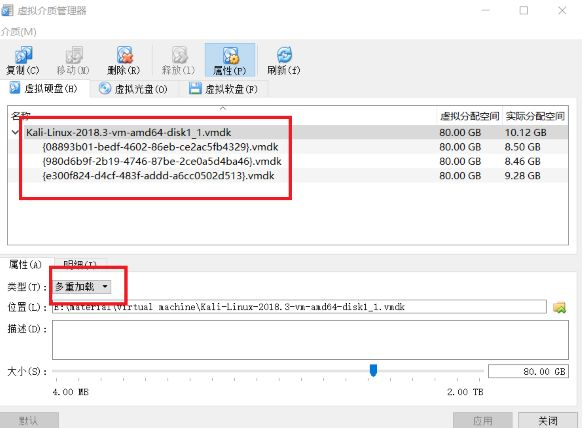

# chap0x01 基于VirtualBox的网络攻防基础环境搭建
## 一、实验环境
- 主机：windows 10
- 虚拟机：virtual box 5.2.18 r124319，
	- Victim,4.17.0-kali1-amd64
	- Attack,4.17.0-kali1-amd64
	- GateWay4.17.0-kali1-amd64 

## 二、实验要求 
- 节点：靶机、网关、攻击者主机
- 连通性
	- 靶机可以直接访问攻击者主机
	- 攻击者主机无法直接访问靶机
	- 网关可以直接访问攻击者主机和靶机
	- 靶机的所有对外上下行流量必须经过网关
	- 所有节点均可以访问互联网
- 其他要求
	- 所有节点制作成基础镜像（多重加载的虚拟硬盘）

## 三、实验步骤
### 多重加载
1. 从教学ftp下载.voa文件，导入虚拟电脑
- 管理->虚拟介质管理->释放
- 类型设置为【多重加载】
- 重新给虚拟机添加虚拟硬盘
- 新建新的虚拟机,选择现有的盘片->成功。
	

	
图中共有三个加载点

问题：

- 释放.vmdk后，移动.vmdk文件位置，为原虚拟机添加虚拟硬盘
	- 报错，UUID already exist
	- 解决：

			C:\Program Files\Oracle\VirtualBox>VBoxManage.exe internalcommands sethduuid "E:\material\virtual machine\Kali-Linux-2018.3-vm-amd64-disk1_1.vmdk"
			UUID changed to: f5d8fb83-048e-414d-9060-e093f7e7f36f
	- 成功添加虚拟硬盘,原来的虚拟机可以使用
- 新建新的虚拟机（此处需要重复一次设置多重加载过程），选择现有的盘片，但是之前那个设置为【多重加载】的.vmdk已经失效，可用的.vmdk（新分配UUID的那个.vmdk）加载方式还是普通加载，所以再重复 重新释放->设置【多重加载】->添加虚拟硬盘 的过程。
	- 新建新的虚拟机->选择已有的盘片（多重加载）->成功 
	
----
### 虚拟机增强功能
1. `apt-get install -y virtualbox-guest-x11`
2. 使用`apt upgrade`进行组件更新，耗时较久。
3. `reboot`
4. 共享粘贴板：选择 设备->共享粘贴板->双向，可用
5. 共享文件夹mount命令挂载文件夹
	1. 在vbox界面建立共享文件夹，设置共享文件夹名称为`sf`
	2. kali命令行挂载文件夹
	
			root@kali:/# cd /mnt
			root@kali:/mnt# mkdir share 
			root@kali:/mnt# ls
			share
			root@kali:/mnt# cd ..
			root@kali:/# mount -t vboxsf sf2 /mnt/share

---
### 网络配置
1. 建立两个隔离的子网
	
图1-1 网络拓扑图

	-  NAT network 启用dhcp
		- Attack,eth0,10.0.2.5/24
		- GateWay,eth0,10.0.2.4/24
	-  internal network 静态配置IP
		- Victim,eth0,192.168.0.1/24，defalut fateway：192.168.0.1
		- GateWay,eth1,192.168.0.254/24
	- 经配置后的网络状态是：
		- 处于同一子网的两个主机可以相互ping通
		- NAT network模式的子网可以连接Internet，internal网络模式下子网无法连接Internet
		- 靶机无法ping通主机，主机无法ping通靶机
- 尝试靶机ping主机，并在网关的两块网卡上抓包
	- 使用tcpdump命令抓包，查看icmp包转发状态，发现需要在网关上开启ip forward
	
		
图1-2 网关未开启IP forward时icmp包转发情况

	- 配置ip forward `echo 1 >/proc/sys/net/ipv4/ip_forward`
	
		
图1-3 网关开启IP forward时icmp包转发情况

- 尝试靶机ping主机，在主机上抓包，分析icmp包信息
	 
	- 主机已回复icmp包，根据路由表推测回复包被转发到了Internet（根据实验后期测试，10.0.2.1应该是NAT network的默认网关，用于连接Internet）

	
	
图1-4 推测icmp echo reply被转发到互联网

	- 为了使主机能成功将icmp echo reply成功发送到GateWay的eth0端口上，有两种方法：
		1. **（不采用）**将主机的default gateway设置为GateWay eth0网卡的ip地址，默认将主机上的包发到GA eth0，但是不采用此方式，这样会导致主机和靶机之间能相互ping通，违反实验目的
		2. 在GateWay上添加一条防火墙规则，使得主机发送的echo reply可以回到GW上，在命令行执行 `iptables -t nat -A POSTROUTING -s 192.168.0.0/24 -o eth0 -j MASQUERADE`
		
		在主机抓包发现，icmp包在网关上从eth1转发到eth0时源IP被替换为eth0的IP地址，从eth0转发到eth1时目标IP地址又被替换为原来真正的IP地址
		
		
图1-5 设置防火墙规则后能成功转发icmp包

---
### 连通性测试
- 靶机可以直接访问攻击者主机，可以访问互联网
	 
- 攻击者主机无法直接访问靶机，可以访问互联网
	
- 网关可以直接访问攻击者主机和靶机，可以访问互联网
	
- 靶机的所有对外上下行流量必须经过网关
	1. 在网关执行`tcpdump -i eth1 -n -w victim.pcap`抓包
	2. 在靶机上ping主机`ping 10.0.2.15`
	3. 在网关执行`wireshark victim.pcap`
	
## 四、实验结论
### 1. 虚拟机网络模式的选择
	

	
- 由于需要虚拟机之间能相互访问，且不希望主机造成流量泄露，所以选择了Internal和NAT network（至于是否会真的造成流量泄露还不清楚，但还是先暂且“避免”了）
### 2. 设置NAT network
- 发现无效设置，未指定网络名称
	- 解决：全局设置->网络->添加NAT网络
### 3. 设置防火墙规则
- 参考：[https://kali.training/topic/firewall-or-packet-filtering/](https://kali.training/topic/firewall-or-packet-filtering/)
	
   
	How Netfilter Chains are Called 

- Netfilter uses four distinct tables：filter，nat (Network Address Translation) ，mangle
	- The filter table has three standard chains:
		- INPUT: concerns packets whose destination is the firewall itself;
		- OUTPUT: concerns packets emitted by the firewall;
		- FORWARD: concerns packets passing through the firewall (which is neither their source nor their destination).
	- The nat table also has three standard chains:
		- PREROUTING: to modify packets as soon as they arrive;
		- POSTROUTING: to modify packets when they are ready to go on their way;
		- OUTPUT: to modify packets generated by the firewall itself.
- ` iptables -t nat -A POSTROUTING -s 192.168.0.0/24 -o eth0 -j MASQUERADE`命令实现的功能是在NAT表中添加一条POSTROUTING规则，使得来自192.168.0.0/24网络的包能被转发到eth0，采用PMASQUERADE规则:apply masquerading (a special case of Source NAT)
### 4. IP forward理解
- 参考：[https://unix.stackexchange.com/questions/14056/what-is-kernel-ip-forwarding](https://unix.stackexchange.com/questions/14056/what-is-kernel-ip-forwarding "理解ipforward")

### 5. NAT network如何实现连接互联
- 参考：[https://www.virtualbox.org/manual/ch06.html#network_nat_service](https://www.virtualbox.org/manual/ch06.html#network_nat_service "虚拟机网络配置")
> The network frames sent out by the guest operating system are received by VirtualBox's NAT engine, which extracts the TCP/IP data and resends it using the host operating system. To an application on the host, or to another computer on the same network as the host, it looks like the data was sent by the VirtualBox application on the host, using an IP address belonging to the host. VirtualBox listens for replies to the packages sent, and repacks and resends them to the guest machine on its private network.

> The virtual machine receives its network address and configuration on the private network from a DHCP server integrated into VirtualBox. The IP address thus assigned to the virtual machine is usually on a completely different network than the host. As more than one card of a virtual machine can be set up to use NAT, the first card is connected to the private network 10.0.2.0, the second card to the network 10.0.3.0 and so on.

----

参考同学作业：

- [https://github.com/CUCCS/2018-NS-Public-TheMasterOfMagic/blob/ns-chap0x01/ns/chap0x01/%E5%9F%BA%E4%BA%8EVirtualBox%E7%9A%84%E7%BD%91%E7%BB%9C%E6%94%BB%E9%98%B2%E5%9F%BA%E7%A1%80%E7%8E%AF%E5%A2%83%E6%90%AD%E5%BB%BA.md](https://github.com/CUCCS/2018-NS-Public-TheMasterOfMagic/blob/ns-chap0x01/ns/chap0x01/%E5%9F%BA%E4%BA%8EVirtualBox%E7%9A%84%E7%BD%91%E7%BB%9C%E6%94%BB%E9%98%B2%E5%9F%BA%E7%A1%80%E7%8E%AF%E5%A2%83%E6%90%AD%E5%BB%BA.md)
- [https://github.com/CUCCS/2018-NS-Public-jckling/pull/1](https://github.com/CUCCS/2018-NS-Public-jckling/pull/1)

