# chap0x05 自己动手编程实现并讲解TCP connect scan/TCP stealth scan/TCP XMAS scan/UDP scan 

## 1. 实验环境
- 主机：windows10
- 虚拟机：virtual box 5.2.18 r124319，4.17.0-kali1-amd64
- 工具：python3.7.0, scapy2.4.0, nmap 7.70
## 2. 网络扫描知识梳理
- 目标：
	- 主机（端口开发情况，网络服务详细信息）
	- 网络（网络拓扑）
	- 服务（版本信息+匹配漏洞信息库查看是否存在已知漏洞）
	- 人（习惯、爱好）
- 步骤
	- 踩点
		- 收集的信息：（1）管理信息、技术信息、客户信息和一些账单的信息。包括员工姓名、电子邮件地址、电话和传真号码等；（2）IP 地址范围；（3）DNS 服务器；（4）邮件服务器。并且我们也可以识别一些直接连接到互联网上的系统。
		- 方式
			- 自由访问
			- 黑盒（可使用特定的客户端连接指定端口/应用/服务，例如使用浏览器 /FTP/telnet 远程连接等；也可使用特定账号和口令尝试登陆；或者进行交互模仿的方式进行信息采集。）
	- 扫描
		- 收集的信息：（1）运行在每个系统的 TCP/UDP 服务的识别；（2）系统架构（Unix、windows 等）；（3）通过互联网访问系统特定的 IP 地址；（4）操作系统的类型和漏洞等级。简言之扫描就如同一个盗贼对想进入的房子的所有门和窗户进行检测。
		- 技术
			-  PING、端口扫描和操作系统识别均可称之为网络扫描
	- 枚举
		- 针对于操作系统，可收集的信息有：用户和用户组的名称、系统的类型、路由表和 SNMP 信息
		- 枚举就是从系统中提取有效的账户或输出的资源信息的整个过程。 
- 可行性：关于协议的标准和（操作系统）协议栈的关系可以看作为：协议标准是种声明，是一种严格统一和规范的标准。如：RFC 793 TRANSMISSION CONTROL PROTOCOL 、RFC 768 User Datagram Protocol 、RFC 791 INTERNET PROTOCOL 、RFC 792 Internet Control Message Protocol 等。协议栈便是对协议标准的实现，理论上来说应严格遵守标准、完整实现。但从大量实践统计来看，不同开发者由于水平差异、任务优先级排序原因等会在实现协议标准时「偷工减料」或「简化实现」，这就造成了同一种协议标准在不同操作系统、不同应用系统中表现出了不同的「协议行为」，这种「行为差异」成为了网络扫描识别目标服务、目标主机信息的可行性基础。

-----

###  局域网主机扫描
- 扫描知识库构建
- 主机状态
- 端口状态
### 端口扫描

- 开放扫描
	- TCP Connect 扫描 √ 
		- 优：是稳定可靠，不需要特殊的权限。
		- 缺：扫描方式不隐蔽，服务器日志会纪录下大量密集的连接和错误记录，并容易被防火墙发现和屏蔽。
	- TCP 反向 ident 扫描
	- UDP 扫描 √ （open和filtered状态都是无响应，无法区分）
		- 缺：UDP 是不可靠的，UDP 数据包和 ICMP 错误报文都不保证到达（被防火墙或其他过滤数据包软件过滤时误判为端口可达）；且 ICMP 错误消息发送效率是有限的，故而扫描缓慢；还有就是非超级用户无法直接读取端口访问错误。
- 半开放扫描
	- TCP SYN 扫描 √
		- 优：隐蔽性较全连接扫描好，因为很多系统对这种半扫描很少记录。
		- 缺：是构建 SYN 报文需要超级用户权限，且网络防护设备会有记录。
	- TCP 间接扫描
- 隐蔽扫描
	- TCP FIN 扫描
	- TCP Xmas 扫描 √ （open和filtered状态都是无响应，无法区分）
		- 优点是隐蔽性好，缺点是需要自己构造数据包，要求拥有超级用户或者授权用户权限。
	- TCP Null 扫描 
	- 分段扫描
	- ACK 扫描
	- IDLE 扫描
## 3. 实验步骤

	- nmap使用
		- ping扫描 `-sP`  
		- 端口扫描 `-sT` 
		- 隐蔽扫描 `-sS`
		- Xmas扫描 `-sX`
		- UDP扫描 `-sU`
		- 选项功能
			- 探测目标主机的操作系统 `-O`
			- 指定诱骗地址 `-D`
			- 允许关闭ICMP ping `-P0`
			- 启用版本检测 `-sV`
		- 常见应用
			- 获取网络中所有存活的主机 `nmap -sP 222.31.66.128/25`
			- 获取指定开放端口的服务器列表 `nmap -sT -p 80 -oG – 222.31.66.* | grep open `
			- 寻找一个给定子网中未使用的ip `nmap -T4 -sP 192.168.2.0/24 && grep ‘00:00:00:00:00:00’ /proc/net/arp`
- 网络拓扑

	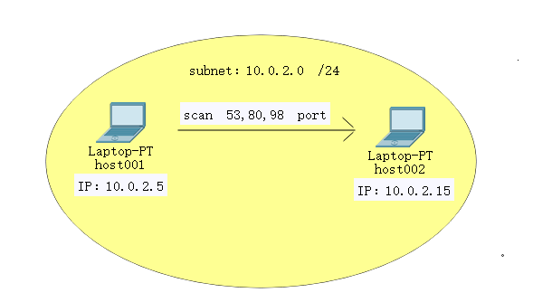

### 3.1 TCP Connect 扫描 
根据代码逻辑构造的3种端口
- OPEN：host002 port 80，在host002开启apache服务，80端口就处于监听模式（试了一下用apache监听80端口）
- CLOSED：host002 port 53，无操作
- FILTERED：host003 port 98，定义iptables,在input链上添加一条规则 `iptables -A INPUT -p tcp --dport 98 -j DROP`，使得98端口收到的tcp包直接丢弃，不回复任何包
#### a. 手动编写代码 
通过手动编写的tcp connect scan 代码扫描以上3个端口，与预期结果一致

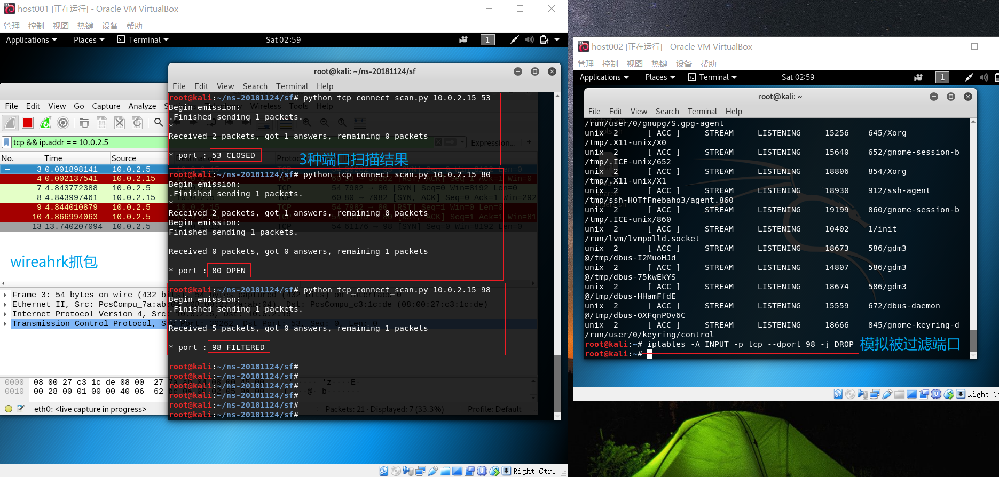 
	
使用wireshark flow Graph查看效果

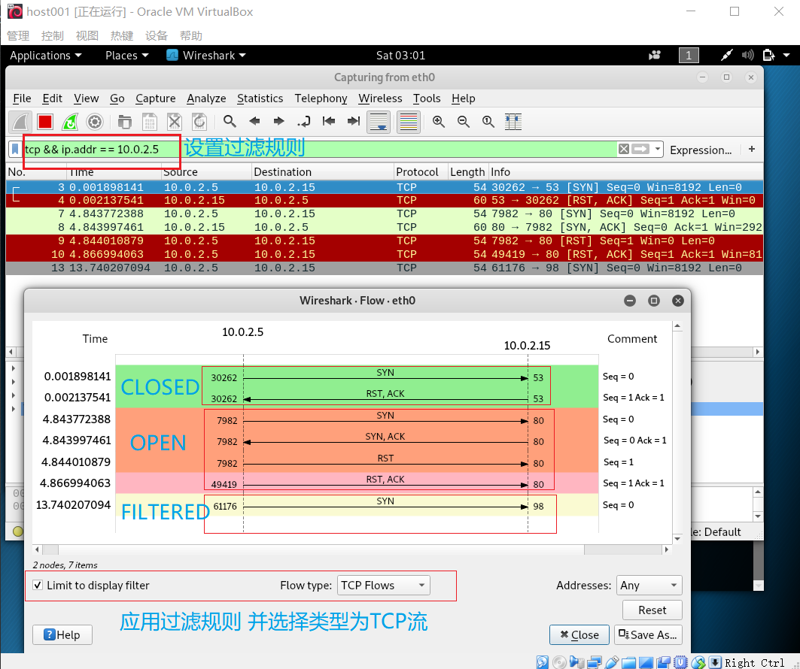 
#### b. nmap进行同类扫描
使用nmap进行同类扫描，扫描结果与手动编写的代码相同

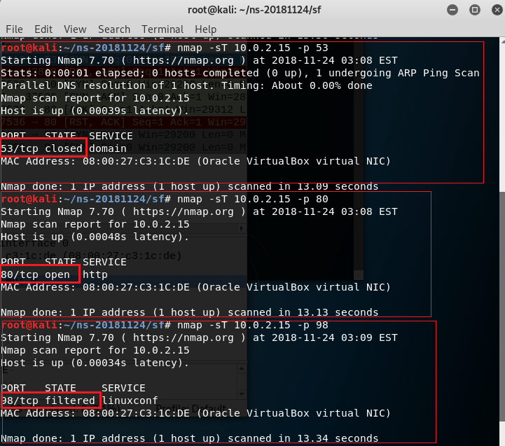 

使用wireshark flow Graph查看nmap扫描结果

 


- 代码：

	```python
	###################################
	# tcp flag意义 
	# 0x002(SYN)
	# 0x012(SYN,ACK)
	# 0x010(ACK)
	# 0x004(RST)
	# 0x014(RST,ACK)
	###################################
	# type,code 意义
	# 3,1   Host Unreachable——主机不可达
	# 3,3	Port Unreachable——端口不可达
	# 3,2	Protocol Unreachable——协议不可达
	# 3,9	Destination network administratively prohibited——目的网络被强制禁止
	# 3,10	Destination host administratively prohibited——目的主机被强制禁止
	# 3,13	Communication administratively prohibited by filtering——由于过滤，通信被强制禁止
	###################################
	def tcp_connect_scan(dst_ip, dst_port, dst_timeout):
		'''
		:param dst_ip:string,目标IP
		:param dst_port: 端口号
		:param dst_timeout:
		:return:端口状态
		'''
		src_port = RandShort()
		tcp_connect_scan_resp = sr1(IP(dst=dst_ip) / TCP(sport=src_port, dport=dst_port, flags="S"), timeout=dst_timeout)
		if (str(type(tcp_connect_scan_resp)) == "<class 'NoneType'>"):# no responses的情况,端口被过滤
			return("FILTERED")
		elif (tcp_connect_scan_resp.haslayer(TCP)):
			if (tcp_connect_scan_resp.getlayer(TCP).flags == 0x12): # (SYN,ACK)
				send_rst = sr(IP(dst=dst_ip) / TCP(sport=src_port, dport=dst_port, flags="AR"), timeout=dst_timeout)# 回复ACK,RST
				return ("OPEN")
			elif (tcp_connect_scan_resp.getlayer(TCP).flags == 0x14):# (RST,ACK)
				return ("CLOSED")
		else:
			return ("CHECKED")
	```
### 3.2 UDP scan 
根据代码逻辑构造的3种端口
- OPEN：host002 port 80，执行`nc -u -l -p 80` 开启80端口(再也不能无脑复制粘贴命令 `< /etc/passwd`)
- CLOSED：host002 port 53，无操作
- FILTERED：host003 port 98，定义iptables,在input链上添加一条规则如下图，回复的icmp包type=3，code=9，可被判断为被过滤状态

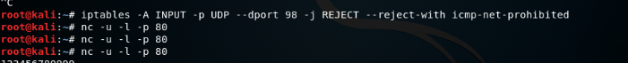

#### a. 手动编写代码 


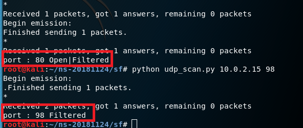

开放端口，根据代码逻辑，通过重传包后仍然为收到回复，判断为OPEND | FILTEREDD
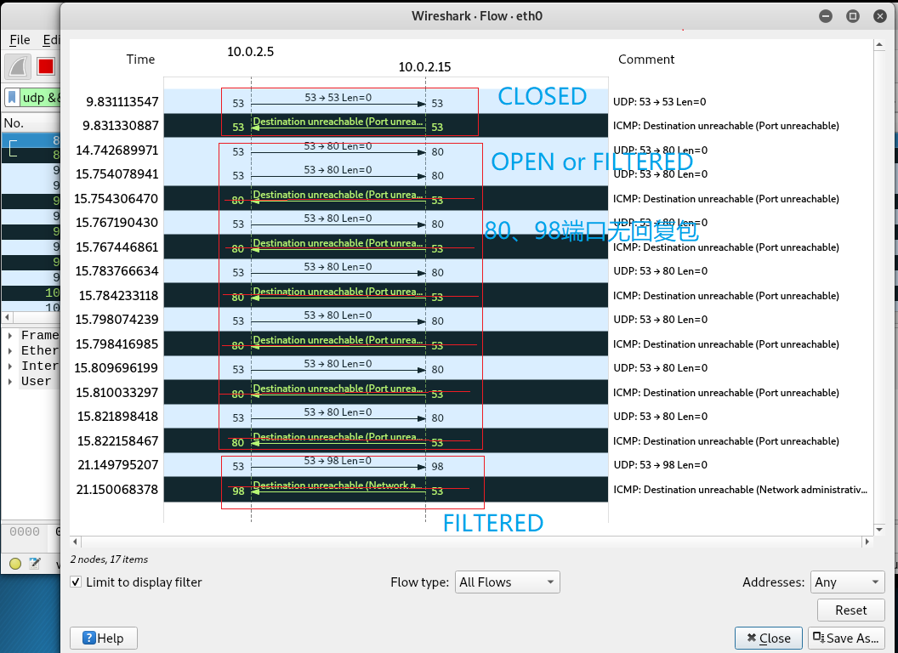

#### b. nmap进行同类扫描

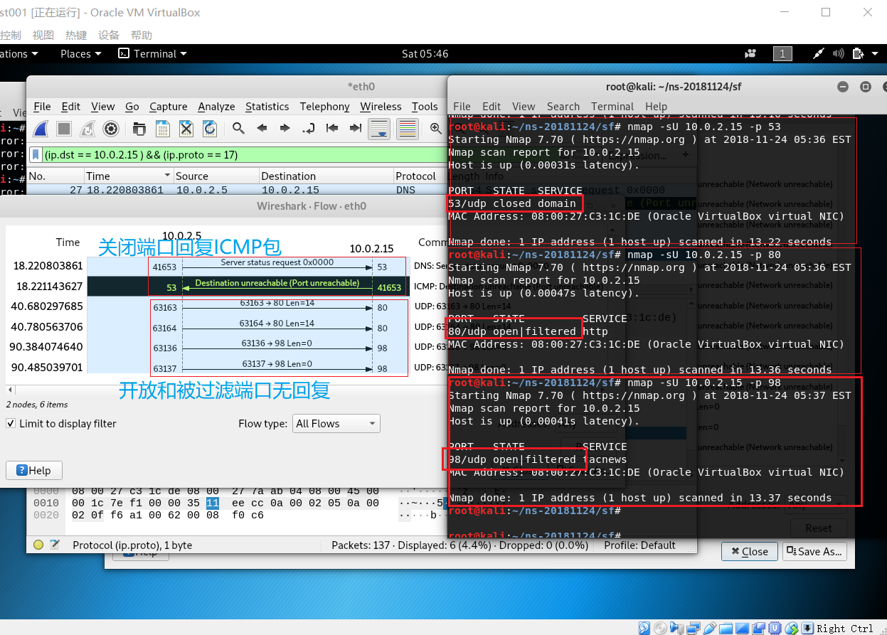

以下是上次实验遇到的问题，应该是没有提前抓包的原因

> 由于没有抓到包，所以用nmap进行相同的udp扫描，扫描前在host002 执行`nc -u -l -p 98 < /etc/passwd` 开启98端口。结果：扫描53端口被跳过了？其余与预期结果一致（开启的98端口回复UDP包，关闭的80端口回复ICMP Destination Unreachable）

- 代码:
	```python
	def udp_scan(dst_ip, dst_port, dst_timeout):
		udp_scan_resp = sr1(IP(dst=dst_ip) / UDP(dport=dst_port), timeout=dst_timeout)
		if (str(type(udp_scan_resp)) == "<class 'NoneType'>"):
			retrans = []
			for count in range(0, 3):
				retrans.append(sr1(IP(dst=dst_ip) / UDP(dport=dst_port), timeout=dst_timeout))
			for item in retrans:
				if (str(type(item)) != "<class 'NoneType'>"):
					udp_scan(dst_ip, dst_port, dst_timeout)
			return "Open|Filtered"

		elif (udp_scan_resp.haslayer(UDP) or udp_scan_resp.getlayer(IP).proto == IP_PROTOS.udp):
			return "Open"
		elif (udp_scan_resp.haslayer(ICMP)):
			if (int(udp_scan_resp.getlayer(ICMP).type) == 3 and int(udp_scan_resp.getlayer(ICMP).code) == 3):
				# 3,3 Port Unreachable——端口不可达
				return "Closed"
			elif (int(udp_scan_resp.getlayer(ICMP).type) == 3 and int(udp_scan_resp.getlayer(ICMP).code) in [1, 2, 9, 10,
																									13]):
				return "Filtered"
		else:
			return "CHECK"
	```
### 3.3 TCP SYN scan 
端口设置和TCP connect scan一致

#### a. 手动编写代码 
抓包结果和预期一致，对于开放端口，收到[SYN,ACK]后只回复[RST] (而不是[RST,ACK])体现出了tcp syn 扫描的 **隐蔽** 性，对于关闭端口和被过滤端口的判断与TCP connect scan一致

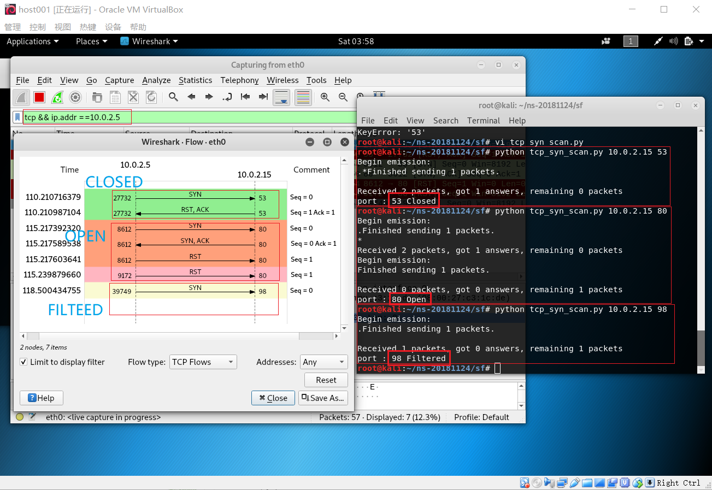


#### b. nmap同类扫描
结果与手动编写代码一致

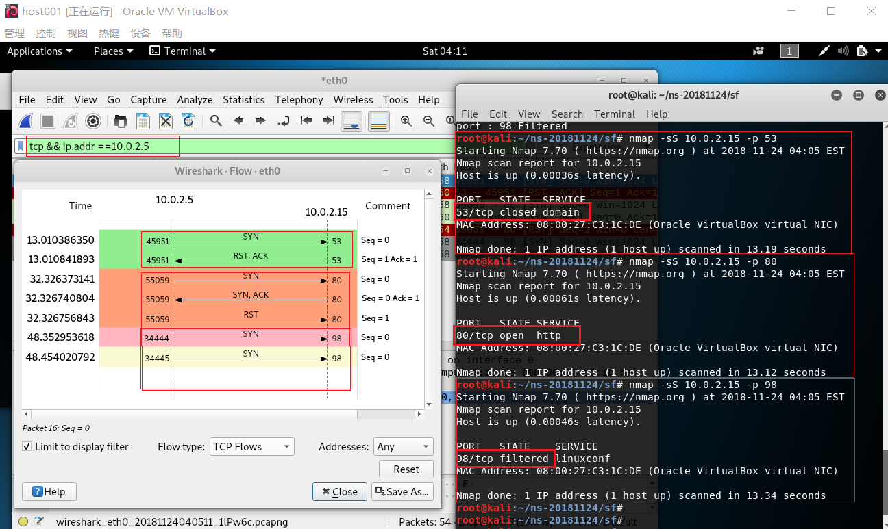

- 代码：
	```python
	def tcp_syn_scan(dst_ip, dst_port, dst_timeout):
		'参考stealth_scan'
		filtered_cnt = 0
		closed_cnt = 0
		src_port = RandShort()
		stealth_scan_resp = sr1(IP(dst=dst_ip) / TCP(sport=src_port, dport=dst_port, flags="S"), timeout=dst_timeout)
		if (str(type(stealth_scan_resp)) == "<class 'NoneType'>"): #
			return "Filtered"
		elif (stealth_scan_resp.haslayer(TCP)):
			if (stealth_scan_resp.getlayer(TCP).flags == 0x12):# (SYN,ACK)
				# 只回复RST，与connect scan的区别
				send_rst = sr(IP(dst=dst_ip) / TCP(sport=src_port, dport=dst_port, flags="R"), timeout=dst_timeout)
				return "Open"
			elif (stealth_scan_resp.getlayer(TCP).flags == 0x14):# (RST,ACK)
				return "Closed"
		elif (stealth_scan_resp.haslayer(ICMP)):
			if (int(stealth_scan_resp.getlayer(ICMP).type) == 3 and
					int(stealth_scan_resp.getlayer(ICMP).code) in [1, 2, 3, 9, 10, 13]):
				return "Filtered"
		else:
			return "CHECK"
	```
### 3.4 Xmas scan
端口设置和TCP connect scan一致

#### a. 手动编写代码
只能区分关闭端口和非关闭端口，无法区分非关闭端口处于开放或是被过滤状态。


#### b. nmap同类扫描
与预期结果一致, timout设置不同,发送包的数量也和手动编写代码不一样

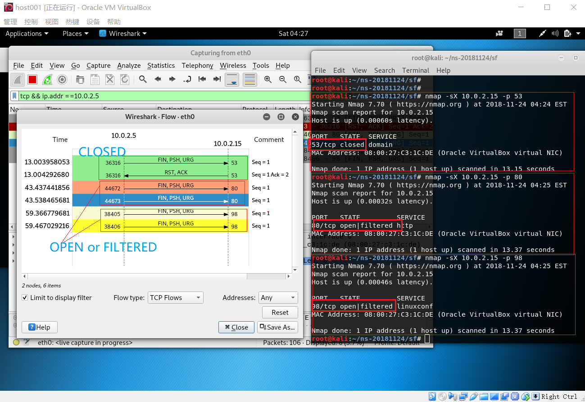

- 代码：
	```python
	def xmas_scan(dst_ip, dst_port, dst_timeout):
		xmas_scan_resp = sr1(IP(dst=dst_ip) / TCP(dport=dst_port, flags="FPU"), timeout=dst_timeout)
		if (str(type(xmas_scan_resp)) == "<class 'NoneType'>"):
			return "Open|Filtered"
		elif (xmas_scan_resp.haslayer(TCP)):
			if (xmas_scan_resp.getlayer(TCP).flags == 0x14):# (RST,ACK)
				return "Closed"
		elif (xmas_scan_resp.haslayer(ICMP)):
			if (int(xmas_scan_resp.getlayer(ICMP).type) == 3 and int(xmas_scan_resp.getlayer(ICMP).code) in [1, 2, 3, 9, 10,13]):
				return "Filtered"
		else:
			return "CHECK"
	```
## 4. 实验分析
### 4.1 UDP scan 扫描失败分析
- 由于执行手动编写的udp扫描代码时没有抓到包，推测存在的问题：
	- 推测1：wireshark抓包失败
		- 在host001 执行`nc -sU 10.0.2.5` 对host002的常用端口进行扫描，保证关闭的端口能回复 ICMP Destination Unreachable包，如图可正常回复，所以wireshark抓包没有问题
	
            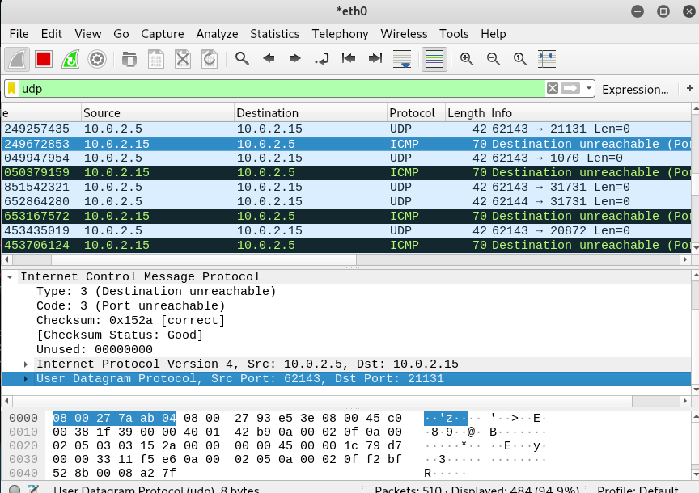
	- 推测2：host002可能有某种防扫描的安全机制，不回复任何我使用scapy构造的包		
		- 在host002 执行`nc -u -l -p 53 < /etc/passwd` 开启53端口，再次执行手动编写的udp_scan代码，此时可抓到syn包（之前可能抓包晚了，连syn都没抓到），但是没有抓到回复包（关闭的端口期望ICMP Destination Unreachable，开启的端口期望 显示传输层报文为udp的ip包）

			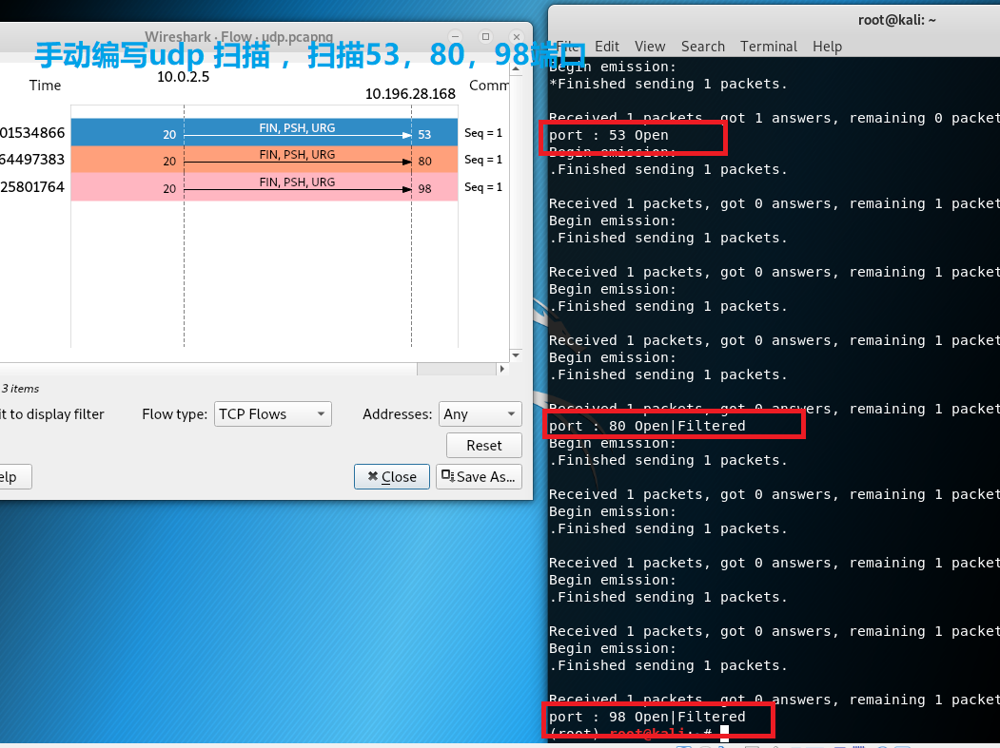

			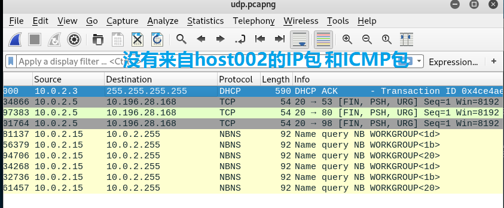

	- 问题：既然wireshark抓包没有问题，为什么手写的程序可以判断53端口为开启，但是看不到任何回复包呢？
		答案是flow graph过滤类型选择了TCP Flows，当然无法显示icmp或者udp包


### 4.2 手写的端口扫描代码普遍收不到回复包
- 在手写的4个扫描端口代码中，除了TCP connect 扫描能按预期扫描，其他TCP syn扫描，Xmas扫描，UDP扫描都收不到回复的包，而相同功能的nmap工具，可以正常扫描。所以推测 被扫描主机是不是能分辨用scapy自主构造的包，并且不回复呢 ？

	确实在重新设置了两台虚拟机的网络都为host-only之后就没有出现这个问题

## 参考：
- [网络安全课本](https://sec.cuc.edu.cn/huangwei/textbook/ns/)
- [推荐本地开发环境同时管理-python2-和-python3-的方法](https://sec.cuc.edu.cn/huangwei/textbook/mis/chap0x02/scapy.html#%E6%8E%A8%E8%8D%90%E6%9C%AC%E5%9C%B0%E5%BC%80%E5%8F%91%E7%8E%AF%E5%A2%83%E5%90%8C%E6%97%B6%E7%AE%A1%E7%90%86-python2-%E5%92%8C-python3-%E7%9A%84%E6%96%B9%E6%B3%95)
- [Nmap命令扫描详解](https://blog.csdn.net/chengxuyuanyonghu/article/details/55098900)
- [Port Scanning using Scapy](https://resources.infosecinstitute.com/port-scanning-using-scapy/)
- [icmp type code 对应表](https://blog.csdn.net/jack237/article/details/7378848)

同学作业：

- [CUCCS/2018-NS-Public-xaZKX/pull/4#issuecomment](https://github.com/CUCCS/2018-NS-Public-xaZKX/pull/4#issuecomment-430242698)
