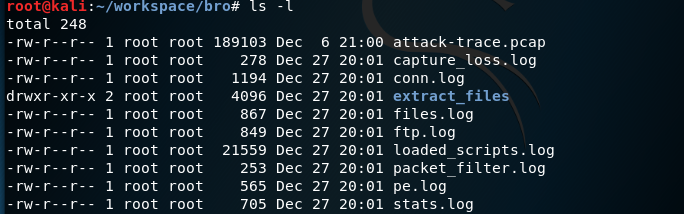

# chap0x0c  实战Bro网络入侵取证

## 实验环境

虚拟机：virtual box 5.2.18 r124319，4.17.0-kali1-amd64

## 实验流程

### 环境搭建

    apt policy bro # 查看镜像源中bro版本
    apt-get install bro bro-aux  # 安装bro及其辅助工具（已安装好，显示已经安装最新版本）


### 实验环境基本信息

```markdown
which bro # 查看bro路径
uname -a  # 查看
bro -v # 查看bro版本
```


### 编辑bro配置文件

- `vi /etc/bro/site/local.bro` 编辑内容如下看，从流量中自动提取所有识别的协议；在主配置文件加载个人的文件


- `vi /etc/bro/site/mytuning.bro` 编辑个人文件内容如下，做如下参数选项。

  设置不进行数据包校验，避免因为计算方式不同出现一些报错，设置在ftp.log中显示捕获的FTP登录口令


### 用bro自动化分析pcap文件

- `wget https://sec.cuc.edu.cn/huangwei/textbook/ns/chap0x12/attack-trace.pcap` 获取pcap文件

	

- ` bro -r attack-trace.pcap /etc/bro/site/local.bro` 自动化分析pcap包

	

- `ls -l`成功后查看文件夹下文件及权限，出现很多日志信息和和extract_files文件夹

	

- `ls extract_files/`查看extract_files文件夹下文件

  `file extract_files/extract-1240198114.648099-FTP_DATA-FHUsSu3rWdP07eRE4l` 发现该文件是一个可执行文件

  FHUsSu3rWdP07eRE4l是bro标识会话的唯一标识，`grep FHUsSu3rWdP07eRE4l -R .` 在当前目录下搜索该标识发现在pe.log、ftp.log、file.log中都存在。


       ftp.log 从ftp协议中提取的信息
       pe.log 提取出的可执行文件的基本信息，查看文件从哪个协议来，以还原攻击场景
       files.log 无论文件类型是什么，都在此文件件记录（文件类型、哈希值校验方法）
       conn.log 查看所有识别出的会话连接

- 上传至virustotal,历史扫描报告显示这是一个已知的后门程序


- 基于上述报告，再已知这是一个后门程序的前提下，进行逆向推导，查找入侵线索

  `vi /usr/share/bro/base/files/extract/main.bro`查看提取文件的源代码，可知文件名中最后一个组成成分是文件的唯一标识


  搜索该文件的唯一标识，在files.log中找到该文件对应的FTP会话网络会话标识，搜索该网络标识，在conn.log中定位到文件来自的会话信息


### Bro的一些其他技巧使用

- 添加配置显示ftp.log中的捕获的FTP登录口令


- SMB协议的识别

  `vi /etc/bro/site/mytuning.bro` 取消语句注释启用SMB协议支持


- 使用正确的分隔符进行过滤显示

  ```bash
  # 从头开始查看日志文件，显示前1行
  head -n1 conn.log
  # Bro的日志文件默认使用的分隔符显示为ASCII码\x09，通过以下命令可以查看该ASCII码对应的“可打印字符”
  echo -n -e '\x09' | hexdump -c
  # 使用awk打印给定日志文件的第N列数据
  awk -F '\t' '{print $12}' conn.log
  
  ```


- 使用bro-cut更“优雅”的查看日志中关注的数据列

  ```bash
  # 查看conn.log中所有可用的“列名”
  grep ^#fields conn.log | tr '\t' '\n'
  
  # 按照“列名”输出conn.log中我们关注的一些“列”
  bro-cut ts id.orig_h id.orig_p id.resp_h id_resp_p proto < conn.log
  
  # 将UNIX时间戳格式转换成人类可读的时间（但该方法对于大日志文件处理性能非常低）
  bro-cut -d < conn.log
  ```

## 参考
- [网络安全课本](https://sec.cuc.edu.cn/huangwei/textbook/ns/chap0x12/exp.html)
- [网络安全课程回放](http://sec.cuc.edu.cn/ftp/video/ClassroomReplay/NetworkSecurity/)